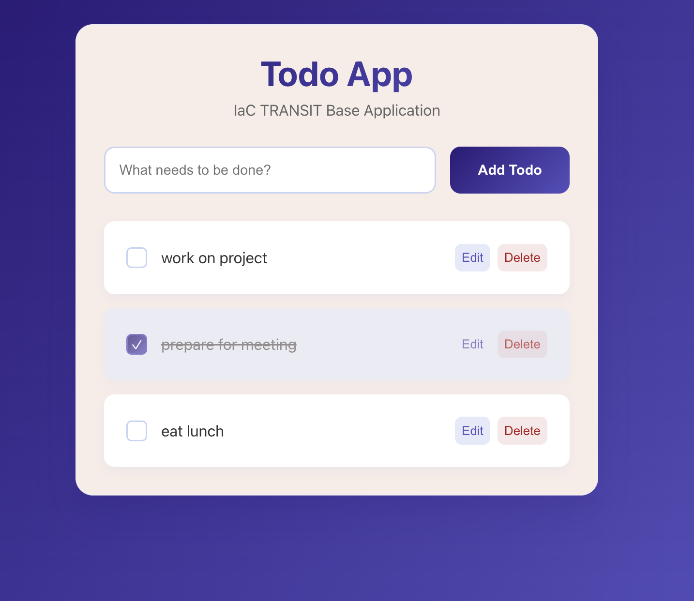

# IaC TRANSIT Base App - To-Do Application

A simple To-Do application built for testing Infrastructure as Code (IaC) translation between AWS, Azure, and GCP. 



## Discovery Cycle Purpose

This base app will be used for our discovery cycle to test how AI tools translate Infrastructure as Code (IaC) between AWS, Azure, and GCP—using a simple full-stack app—to simplify migrations. The goal is to assess tool effectiveness, with deliverables including findings, guidance, and a practical playbook for engineers and architects.

This base app is AWS-native and designed to be translated to other cloud platforms using AI tools.

## Architecture

- **Frontend**: React SPA with modern, sleek UI
- **Backend**: Node.js/Express API
- **Database**: Cloud SQL PostgreSQL (GCP) / RDS PostgreSQL (AWS) / Local JSON for development
- **Infrastructure**: 
  - **GCP**: Cloud Run, Cloud SQL, Secret Manager, VPC Network
  - **AWS**: ECS Fargate, RDS, Secrets Manager, VPC (simplified for discovery cycle)
- **Secrets Management**: GCP Secret Manager / AWS Secrets Manager (production) / Environment variables (local)

## Quick Start

### Prerequisites

- Node.js 18+
- Docker & Docker Compose
- Google Cloud SDK (for GCP deployment) or AWS CLI (for AWS deployment)
- Terraform (for infrastructure)

### Local Development

1. **Clone and setup**:
   ```bash
   git clone <repo-url>
   cd IaC_TRANSIT_baseapp
   cp .env.example .env.local
   ```

2. **Set up sensitive environment variables** (required):
   
   Export database credentials via terminal before running docker compose (use any username/password you prefer):
   ```bash
   export DB_USER=todoapp_user
   export DB_PASSWORD=todoapp_password
   docker compose up
   ```
   
   **Note:** Sensitive credentials must be set via terminal exports, not stored in files. This prevents accidental exposure to AI tools like Cursor.

3. **Start the application**:
   ```bash
   # Using Docker Compose (recommended)
   docker compose up

   # Or manually
   cd backend && npm install && npm start
   cd frontend && npm install && npm start
   ```

4. **Access the app**: http://localhost:3000

### GCP Deployment

#### Prerequisites

1. **Set up GCP project**:
   ```bash
   # Authenticate with GCP
   gcloud auth login
   gcloud config set project YOUR_PROJECT_ID
   
   # Run setup script to enable APIs and create resources
   ./scripts/setup-gcp.sh
   ```

2. **Update Terraform backend** (in `infrastructure/main.tf`):
   - Replace `PROJECT_ID` in the GCS bucket name with your actual project ID

3. **Deploy infrastructure and application**:
   ```bash
   # Set database password
   export DB_PASSWORD=YourSecurePassword123
   
   # Deploy everything
   ./scripts/deploy.sh
   ```

The deployment script will:
- Build and push Docker images to Artifact Registry
- Deploy infrastructure with Terraform
- Create Cloud Run services for frontend and backend
- Set up Cloud SQL PostgreSQL database
- Configure Secret Manager with database credentials

#### Access the Application

After deployment, get the application URL:
```bash
cd infrastructure
terraform output application_url
```

### AWS Deployment

#### ⚠️ Multi-User Deployment Caveat

If multiple participants are deploying to the **same AWS account**, you **must customize resource names** to avoid conflicts:

```bash
terraform apply \
  -var="project_name=YOUR_UNIQUE_NAME" \
  -var="environment=YOUR_ENV" \
  -var="aws_region=us-east-1" \
  -var="db_password=YourSecurePassword123"
```

**Example:** If you're Alice and Bob is also deploying:
- Alice uses: `-var="project_name=alice-todoapp" -var="environment=prod"`
- Bob uses: `-var="project_name=bob-todoapp" -var="environment=staging"`

This creates unique resource names (`alice-todoapp-prod-*` vs `bob-todoapp-staging-*`) and prevents naming conflicts.

If each participant has their own AWS account, the default values are fine.

---

1. **Create AWS Secrets Manager secret**:
   ```bash
   aws secretsmanager create-secret \
     --name todoapp-secrets \
     --description "Todo app database credentials" \
     --secret-string '{
       "db_host": "your-rds-endpoint.amazonaws.com",
       "db_port": "5432",
       "db_name": "todoapp",
       "db_user": "todoapp_user",
       "db_password": "your_secure_password"
     }'
   ```

2. **Deploy infrastructure**:
   ```bash
   cd infrastructure
   terraform init
   terraform plan
   terraform apply
   ```

3. **Deploy application**:
   ```bash
   ./scripts/deploy.sh
   ```

### Teardown / Cleanup

To destroy all AWS resources and stop incurring costs:

```bash
./scripts/destroy.sh
```

This will:
- Destroy all Terraform-managed resources
- Delete ECS services, tasks, and clusters
- Delete RDS instances
- Remove VPC, subnets, and security groups
- Keep CloudWatch logs for 30 days (retention policy)
- Create RDS final snapshot before deletion

## Environment Variables

### Non-sensitive (.env file)
```bash
API_PORT=3001
NODE_ENV=development
AWS_REGION=us-east-1
SECRETS_MANAGER_SECRET_NAME=todoapp-secrets
REACT_APP_API_URL=http://localhost:3001
```

### Sensitive (command line or AWS Secrets Manager)
```bash
DB_HOST=localhost
DB_PORT=5432
DB_NAME=todoapp
DB_USER=todoapp_user
DB_PASSWORD=your_password
```

## Security

### Environment Variables Strategy

This project uses a **two-tier approach** for environment management:

#### Non-Sensitive Configuration (`.env.local`)
- **What goes here:** Database host, port, name, API port, frontend URLs, Node environment
- **Storage:** `.env.local` (gitignored, safe to commit to `.gitignore`)
- **Use case:** Shared configuration that developers need to customize locally
- **Example:** See `.env.example` (committed to git)

#### Sensitive Credentials (Terminal Exports)
- **What goes here:** Database username, password, API keys, secrets
- **Storage:** Terminal environment variables ONLY (`export DB_USER=...`)
- **Never:** Store in `.env`, `.env.local`, or any file
- **Use case:** Prevents accidental exposure to version control and AI tools

**Setup:**
```bash
# Copy non-sensitive config
cp .env.example .env.local

# Export sensitive credentials in current shell
export DB_USER=todoapp_user
export DB_PASSWORD=todoapp_password

# Then run docker compose
docker compose up
```

### Security with AI Tools (Cursor, Claude Code)

#### What is `.cursorignore`?
- Excludes files from Cursor AI context and indexing
- **NOT a complete security guarantee** - it's a convenience feature
- Files listed may still be accessed through system commands or indirect methods

#### Important Warning
**Do NOT rely on `.cursorignore` to protect sensitive data.** Even with `.cursorignore`, credentials in files can potentially be exposed through:
- File system access
- System command execution
- Indirect references
- Caching

**The safe approach:** Keep sensitive data in terminal environment variables only, never in files.

#### `.cursorignore` is for convenience, not security
We use `.cursorignore` to exclude:
- `.env.local` and `.env.*`
- Key files, certificates, secrets directories
- Node modules, build artifacts, etc.

This helps reduce noise in AI processing, but **primary protection comes from not storing secrets in files.**

### Cloud Production Secrets

For production deployment:
- **GCP**: Store all secrets in **GCP Secret Manager**, retrieve at runtime via Secret Manager client
- **AWS**: Store all secrets in **AWS Secrets Manager**, retrieve at runtime via AWS SDK
- Never commit or expose credentials
- See [GCP Deployment](#gcp-deployment) or [AWS Deployment](#aws-deployment) sections for setup

### Best Practices

✅ **DO:**
- Keep sensitive credentials in terminal exports or cloud Secret Manager (GCP Secret Manager / AWS Secrets Manager)
- Use `.env.local` for non-sensitive configuration only
- Add sensitive file patterns to `.cursorignore` and `.gitignore`
- Rotate credentials regularly
- Use strong, unique passwords

❌ **DON'T:**
- Store secrets in `.env`, `.env.local`, or any committed file
- Rely solely on `.cursorignore` for security
- Share terminal exports or commit env files
- Use default/simple passwords in production
- Log sensitive information

## Translation Guide

This application has been translated from AWS to GCP and can be further translated to Azure:

### AWS → GCP (Completed)
- ECS Fargate → Cloud Run
- RDS PostgreSQL → Cloud SQL for PostgreSQL
- Secrets Manager → Secret Manager
- VPC → VPC Network
- CloudWatch Logs → Cloud Logging
- ECR → Artifact Registry
- ALB → Cloud Run built-in HTTPS/routing

### AWS → Azure
- ECS → Azure Container Instances
- RDS → Azure Database for PostgreSQL
- Secrets Manager → Azure Key Vault
- VPC → Azure Virtual Network
- **CloudWatch Logs → Azure Monitor / Azure Log Analytics**

## Logging

The application includes comprehensive logging in both local and cloud environments:

### Local Development
- **Log files**: `backend/logs/*.log` (info.log, error.log, warn.log, debug.log)
- **Features**: Timestamps, log levels, structured metadata
- **Cost**: Free (local file storage)

### GCP Deployment
- **Service**: Cloud Logging
- **Log retention**: 30 days (default)
- **Cost**: ~$0.50–2/month (first 50GB free)
- **Access**: GCP Console → Logging → Logs Explorer

### AWS Deployment
- **Service**: CloudWatch Logs
- **Log group**: `/ecs/todoapp-dev`
- **Retention**: 30 days
- **Cost**: ~$2–5/month
- **Access**: AWS Console → CloudWatch → Log Groups

### Logging Features
- API request logging (endpoint, method, IP, user agent)
- Database operations (connections, queries)
- Error tracking (stack traces, context)
- Application events (startup, shutdown, health checks)
- Real-time log streaming

For detailed logging documentation, see [docs/api.md](docs/api.md).

## API Endpoints

- `GET /api/todos` - Get all todos
- `POST /api/todos` - Create a new todo
- `PUT /api/todos/:id` - Update a todo
- `DELETE /api/todos/:id` - Delete a todo
- `GET /api/health` - Health check

## Contributing

This is a base template for IaC translation testing. Feel free to modify and extend as needed for your specific use case.

## Cost Considerations

### GCP Deployment
- Cloud SQL: ~$7–12/month (db-f1-micro, 31-day backups)
- Cloud Run: ~$5–10/month (scales to zero when not in use, pay per request)
- VPC Flow Logs: ~$0.50/month (Cloud Logging ingestion)
- Artifact Registry: ~$0.10/month (storage)
- Cloud Logging: ~$0.50–2/month (first 50GB free)
- VPC Connector: ~$2–5/month (min instances)

**Total: ~$15–30/month for the GCP stack.**

*Note: Cloud Run automatically scales to zero when not in use, significantly reducing costs during idle periods.*

### AWS Deployment
- RDS: ~$15–20/month (db.t3.micro, 31-day backups)
- ECS Fargate: ~$10–15/month (256 CPU, 512 MB)
- VPC Flow Logs: ~$0.50/month (CloudWatch Logs ingestion)
- KMS encryption: ~$1/month (CMK for logs)
- Data transfer: minimal for testing

**Total: ~$27–37/month for the AWS stack.**

*Note: ALB and NAT Gateways have been removed to reduce costs for the discovery cycle. ECS tasks run in public subnets with direct public IPs, while RDS remains in private subnets for security.*

**Compliance Updates**: Both GCP and AWS infrastructure include VPC Flow Logs, encrypted logging, extended database backup retention (31 days), and restrictive firewall/security group rules to meet baseline compliance requirements.

## Acknowledgments

This application and its Infrastructure as Code were built with the assistance of **Cursor**, an AI-powered code editor.

## License

MIT
